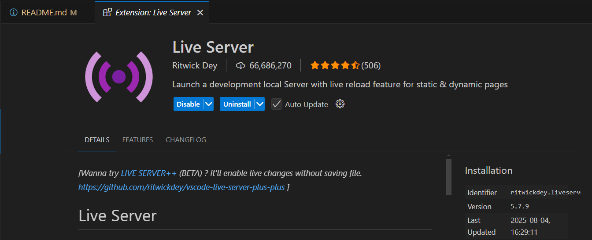
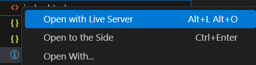

## 🌐 Offline Multilingual Translator

# 🚀 Live Demo
https://alinzlami.github.io/dreamNote/

# ⇄ Branches

1. **main:** For Development
2. **bundled-project:** For bundle, and deployment  

# 🔧 Technologies Used

- 📜 Vanilla JavaScript – Core logic and offline translation functionality, inspired by i18 
- 🖼️ Bootstrap – Responsive UI layout and styling  
- 🎯 AOS.js (Animate On Scroll) – Scroll-based animations for smoother UX  
- 🧠 BEM Methodology – Clear CSS class structure for maintainability  
- 🗣 RTL UI for languages such as Persian and Arabic
- 📦 Module Pattern – Encapsulated logic using JavaScript design principles  
- △ Three.js - A 3D notebook to flip the pages.
- ✅ Cypress Testing
- 🧊 Webpack Bundling
- 🚀 GitHub Pages – Live demo deployment

  # 🌟 Features

- Offline-First Translation Logic  
  Enables basic multilingual translations even when the network is unavailable using client-side caching and fallback logic

- Responsive Homepage Design  
  Mobile-friendly layout with scalable typography and container handling via Bootstrap’s system, and Sass coding

- Smooth User Experience  
  Integrated AOS.js for dynamic scroll-triggered animations to enhance visual engagement

- Clean Architecture  
  Utilizes BEM and JS Module Pattern for better readability, scalability, and maintainability

- Cypress Unit Test
  Tested some sections of the page by Cypress

- 3D Shapes
  Used Three.js to create a 3D notebook, for flipping the pages.

- RTL
  RTL UI for Persian and Arabic languages

- Webpack
  Bundling with Webpack

- Live Demo Deployment  
  Project deployed publicly via GitHub Pages for real-time preview and evaluation

# Usage
1. Run "npm i"

2. Install Live Server

3. Right Click on index.html

